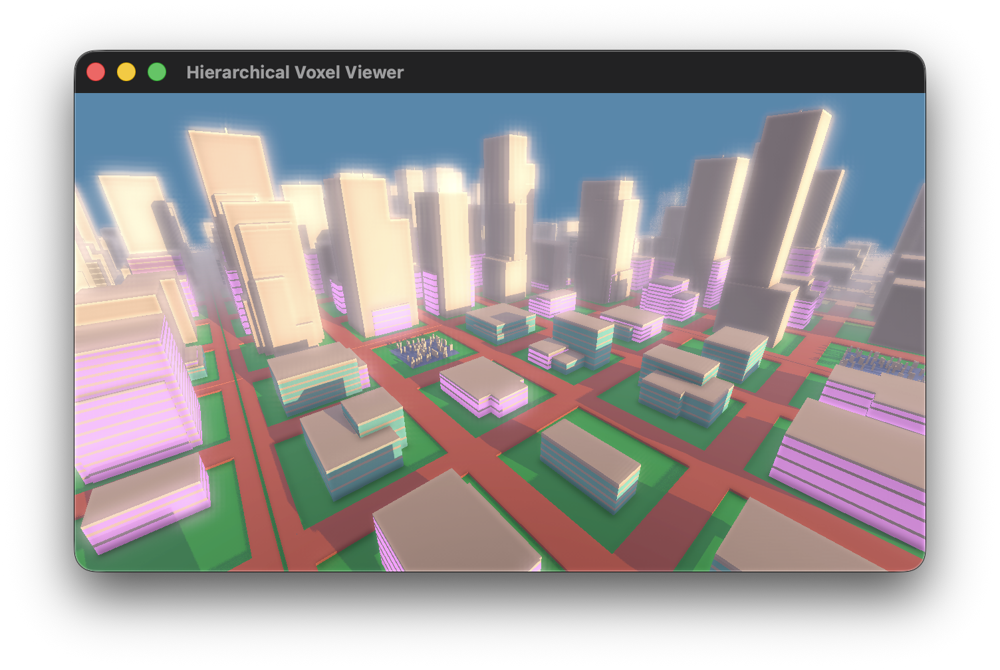

# voxelot

A high-performance sparse voxel engine using hierarchical chunks with LOD and Roaring Bitmaps.



## Features

- **Hierarchical LOD**: Automatic subdivision and merging based on camera distance
- **Fast Culling**: 3-layer performance (marginal → frustum → presence)
- **Memory Efficient**: ~1 byte per voxel with Roaring Bitmap compression
- **Bounded-but-Huge Worlds**: 16^n units (e.g., 16⁴ = 65,536³ voxels)
- **Exact Queries**: No false positives via presence bitmaps
- **True "Chunks All the Way"**: World IS a Chunk - uniform structure at every level!

### Quick Start

```bash
# Run the interactive viewer (release recommended)
cargo run --release --bin voxelot

# Show generator help (Rust)
cargo run --bin generate_world -- --help

# Convert ASCII voxel text to .oct (expects `osm_voxels.txt` in CWD)
cargo run --bin convert_osm_format

# Validate generated world coverage
cargo run --bin check_world_gaps -- worlds/world_1.oct worlds/world_1_meta.json
```

### Data Generation (Voxelizing Real World Tiles)

Two generators are now provided:

1. `voxel_generator_tiles.py` – a Python prototype that synthesizes tile footprints and voxelizes them. The script writes `.oct` files by default (`--format oct`) for direct compatibility with the viewer; use `--format txt` to emit ASCII lines of the form `x y z voxel_type` if you need a human-readable/exportable intermediate.

2. `generate_world` – a Rust generator that implements the same procedural rules, is significantly faster for large areas, and writes compressed `.oct` + full metadata by default. It also supports `--format txt` or `--format both` for ASCII output alongside `.oct`.

**File Format:** The preferred runtime format is the compact binary octree (`.oct`). The example world files are named like `world_1.oct`. If you have an ASCII export (lines `x y z voxel_type`), convert it with `convert_osm_format`:

```bash
# Convert ascii `osm_voxels.txt` (in CWD) into `world_1.oct`
cargo run --bin convert_osm_format
```

**Configuration:** The viewer uses `config.toml` for all settings including world file path, camera position, rendering options, and visual effects. Edit this file to customize your experience.

Planned evolution of the tile generator:
- Replace synthetic footprints with real vector tile (MVT) decoding.
- Add height inference heuristics (already stubbed) and roof shape variants.
- Introduce per-tile material palettes & compressed binary output.
- Hook into streaming residency so tiles load/unload around the camera.

The generators produce a metadata JSON with per-tile stats. The Rust generator (`generate_world`) writes compressed `.oct` files by default and also supports ASCII export via `--format txt` or `--format both`. The Python prototype (`worlds/voxel_generator_tiles.py`) defaults to writing `.oct` as well (`--format oct`) so it can be used directly with the viewer; use `--format txt` to emit ASCII lines `x y z voxel_type` if you need a human-readable intermediate for tooling.

See `VOXEL_GENERATOR_REVAMP.md` for detailed architecture and roadmap (migration notes and seam-fix details).

Regenerate the default New York sample world with the Python generator (now seam-safe):

```bash
python3 worlds/voxel_generator_tiles.py \
    --center-lon -74.0060 \
    --center-lat 40.7128 \
    --zoom 15 \
    --radius 2 \
    --voxels-per-tile 128 \
    --meters-per-voxel 1.25 \
    --max-height-voxels 192 \
    --seed 1337 \
    --output-name worlds/world_1 \
    --format oct
```

Or run the Rust generator to emit `.oct` + metadata directly:

```bash
cargo run --bin generate_world -- \
    --center-lon=-74.0060 \
    --center-lat=40.7128 \
    --zoom=15 \
    --radius=2 \
    --voxels-per-tile=128 \
    --meters-per-voxel=1.25 \
    --max-height-voxels=192 \
    --seed=1337 \
    --output-name=worlds/world_1 \
    --format=oct
```

### Interactive Viewer Controls

**Movement:**
- `WASD` - Move forward/left/backward/right
- `Space` / `Shift` - Move up/down
- `Right Mouse + Drag` - Free-look

**Rotation:**
- `Arrow Left/Right` - Yaw left/right
- `Arrow Up/Down` - Pitch up/down

**Speed Tuning:**
- `-` / `+` - Decrease/increase camera speed multiplier
- `0` - Reset camera speed multiplier

**Runtime Configuration:**
- `Q` / `E` - Decrease/increase camera LOD subdivide distance
- `Z` / `C` - Decrease/increase draw distance (far plane)
- `K` / `L` - Decrease/increase chunk LOD render distance (100-5000 units)
- `T` - Cycle time of day (midnight → sunrise → noon → sunset)
- `F` / `G` - Decrease/increase fog density
- `ESC` - Save config and quit

**Visual Features:**
- **Dynamic Lighting**: Day/night cycle with realistic sun/moon colors and positions
- **Atmospheric Fog**: Exponential distance fog with adjustable density (0.0-0.01)
- **Post-Processing & Effects**: High-quality post pipeline with the following shader-driven effects:
    - **Screen-Space Ambient Occlusion (SSAO)**: multi-slice horizon-based SSAO with a separable blur pass (see `ssilvb.wgsl` and `ssao_blur.wgsl`), blended in the final composite with adjustable strength and debug view.
    - **Bloom**: multi-scale Dual-Kawase bloom extract + blur passes (`bloom_extract.wgsl`, `dual_kawase_down.wgsl`, `dual_kawase_up.wgsl`) for cinematic highlights.
    - **Depth-Of-Field (DoF)**: circle-of-confusion (CoC) generation, blur and combine passes (`dof_coc_copy.wgsl`, `dof_blur.wgsl`, `dof_combine.wgsl`) supporting tilt-shift-like focus control.
    - **Post Composite**: exposure, saturation, SSAO application and bloom blending are handled in a dedicated composite pass (`post_composite.wgsl`).
- **Backface Culling**: GPU-level optimization reducing fragment work by ~50%
- **Distance-Based LOD**: Distant chunks (>800 units default) render as simplified colored blocks
  - Chunks automatically compute average RGBA color (alpha = occupancy)
  - Sparse chunks naturally appear transparent
  - Runtime adjustable with K/L keys for performance tuning
- **Chunk Mesh Streaming**: Greedy-meshed leaf chunks stream in gradually with a fallback preview so camera motion stays stutter-free even when new data appears

Configuration is now unified and saved in structured TOML `config.toml` with tables:

```
[world]        # world file path, initial camera position
[rendering]    # LOD distances, camera planes, FOV, speed multiplier
[atmosphere]   # fog density, time_of_day
[effects]      # bloom, depth of field parameters
[shadows]      # shadow map size / darkness multiplier
[debug]        # debug overlay toggles
```

Only this TOML format is supported; legacy flat key=value config has been removed.

Shadows configuration (examples):

```toml
[shadows]
map_size = 4096
darkness = 1.0 # 1.0 = default; >1 darkens shadows, <1 lightens
backface_ambient_scale = 0.7 # 1.0 = no extra darkening; <1.0 = darker back faces
ao_strength = 0.9 # Strength of baked ambient occlusion (0..1). Lower = stronger AO.
```

### Architecture

```rust
enum Voxel {
    Solid(VoxelType),          // A solid voxel with a type
    Chunk(Box<Chunk>),          // A sub-chunk (for subdivision)
}

struct Chunk {
    px: u16,                    // Marginal X bitmap (fast rejection)
    py: u16,                    // Marginal Y bitmap
    pz: u16,                    // Marginal Z bitmap
    presence: Bitmap,           // Exact presence (Roaring)
    voxels: Vec<Voxel>,         // Indexed by rank - uniform at all levels!
}

struct World {
    root: Chunk,                // The world IS a chunk!
    hierarchy_depth: u8,        // Determines world size: 16^depth
    chunk_size: u32,            // Base chunk size (always 16)
}
```

**World Sizes by Hierarchy Depth:**
- Depth 1: 16³ = 4,096 voxels
- Depth 2: 256³ = 16,777,216 voxels
- Depth 3: 4,096³ = 68,719,476,736 voxels
- Depth 4: 65,536³ = 281,474,976,710,656 voxels

**"Chunks all the way" philosophy:**
- Uniform Chunk structure at every level of hierarchy
- Each position can be either Voxel::Solid or Voxel::Chunk
- Rank-based indexing works identically for leaves and branches
- Projection bits (px/py/pz) propagate up the hierarchy for efficient culling
- No special-casing - same code handles all levels

**Hierarchical LOD Features:**
- Automatic subdivision when camera approaches (< 50 units)
- Automatic merging when camera recedes (> 100 units)
- Recursive frustum culling descends into sub-chunks
- Marginal culling works at all hierarchy levels
- Distance-based rendering decisions

**Implemented Systems:**
- 6-plane frustum culling (fixed cross-product bug)
- Marginal projection bit culling
- Occlusion culling with front-to-back traversal
- Parallel chunk processing with rayon
- Spatial visibility caching


# Skybox
The skybox image is CC0, downloaded from [Polyhaven](https://polyhaven.com).

